# Julius Baer AML Platform - System Architecture Diagram

## Complete System Architecture

```mermaid
graph TB
    subgraph "Client Layer - Browser"
        USER[👤 End Users]
        COMPLIANCE[🛡️ Compliance Officer]
        RM[💼 Relationship Manager]
    end

    subgraph "Frontend Layer - Next.js 14 - Port 3000"
        subgraph "Pages & Routes"
            LANDING["Root - Role Selector"]
            COMP_DASH["compliance - Dashboard"]
            COMP_REVIEW["compliance review reviewId"]
            RM_DASH["rm - RM Dashboard"]
            RM_CLIENT["rm clientId - Portfolio"]
            ALERT_INV["investigation alertId"]
        end

        subgraph "Component Architecture"
            direction LR
            UI_LIB["shadcn ui Components<br/>Button Card Table Dialog etc"]
            COMP_COMPS["Compliance Components<br/>KanbanBoardDnD<br/>DocumentUploadAnalysis<br/>RiskScoreCard<br/>ClientProfile"]
            RM_COMPS["RM Components<br/>ClientPortfolioDetail<br/>SmartRecommendations<br/>TransactionHistory<br/>AdverseMediaFeed"]
            INV_COMPS["Investigation Components<br/>TransactionDetails<br/>DocumentViewer<br/>AgentFindings<br/>HistoricalContext"]
            CHARTS["Chart Components<br/>LineChart PieChart<br/>Recharts"]
        end

        subgraph "State & Data Management"
            REACT_QUERY["React Query<br/>tanstack react-query<br/>Data Fetching & Caching"]
            API_CLIENT["API Client<br/>lib api.ts<br/>Supabase Integration"]
            MOCK_DATA["Mock Data<br/>Development Fallback"]
            REC_ENGINE["Recommendation Engine<br/>AI-driven suggestions"]
        end
    end

    subgraph "Backend Layer - FastAPI - Port 8000"
        subgraph "Main AML Platform API"
            MAIN_APP["main.py<br/>FastAPI Application"]

            subgraph "API Routes"
                ALERT_API["api alerts<br/>Summary Active Details Remediate"]
                TRANS_API["api transactions<br/>Volume History"]
                AUDIT_API["api audit-trail<br/>Audit Logs"]
                WS_API["ws alerts<br/>WebSocket Real-time"]
            end

            subgraph "AI Agent System"
                ORCHESTRATOR["Agent Orchestrator<br/>Multi-agent coordinator"]
                REG_AGENT["Regulatory Watcher<br/>FINMA Compliance"]
                TRANS_AGENT["Transaction Analyst<br/>Pattern Analysis"]
                DOC_AGENT["Document Forensics<br/>Tampering Detection"]
            end

            DB_SERVICE["Database Service<br/>Mock Supabase Integration"]
        end

        subgraph "Document Corroboration System API"
            CORR_APP["src backend main.py<br/>Document Analysis FastAPI"]

            subgraph "Corroboration Routes"
                OCR_API["api v1 ocr<br/>Text Extraction"]
                DOC_PARSE_API["api v1 documents<br/>Parse Extract Tables"]
                CORR_API["api v1 corroboration<br/>Analyze Validate Report"]
            end

            subgraph "Document Processing Pipeline"
                direction TB
                OCR_SVC["OCR Service<br/>Docling Engine<br/>Text Extraction"]
                DOC_SVC["Document Service<br/>PDF DOCX Image Parser<br/>Table Extraction"]
                DOC_VAL["Document Validator<br/>Format Structure Content<br/>spaCy NLP"]
                IMG_ANALYZER["Image Analyzer<br/>EXIF AI Detection<br/>ELA Tampering<br/>Forensics"]
                RISK_SCORER["Risk Scorer<br/>Multi-factor Scoring<br/>Weighted Algorithm"]
                REPORT_GEN["Report Generator<br/>Audit Logs JSON Reports<br/>Markdown Export"]
                CORR_SVC["Corroboration Service<br/>Pipeline Orchestrator"]
            end
        end
    end

    subgraph "Data Layer"
        subgraph "Database - Supabase PostgreSQL"
            direction TB
            ALERTS_TBL[("alerts<br/>AML Alerts<br/>Agent Findings<br/>Document Issues")]
            TRANS_TBL[("transactions<br/>Financial Transactions<br/>Client History")]
            DOCS_TBL[("documents<br/>Document Metadata<br/>Analysis Results")]
            AUDIT_TBL[("audit_logs<br/>Complete Audit Trail<br/>User Actions")]
            CLIENTS_TBL[("clients<br/>Client Information<br/>KYC Data")]
        end

        subgraph "File Storage"
            TMP_STORAGE["tmp uploads<br/>Temporary Files"]
            AUDIT_FILES["tmp corroboration audit<br/>JSONL Audit Logs"]
            REPORT_STORAGE["JSON Report Storage<br/>Full Analysis Reports"]
        end
    end

    subgraph "External Services & APIs"
        subgraph "AI & ML Services"
            GROQ["Groq API<br/>llama-3.1-70b-versatile<br/>llama-3.2-90b-vision<br/>AI Agent Intelligence"]
            SIGHTENGINE["SightEngine API<br/>AI-Generated Image Detection<br/>Content Moderation"]
            GOOGLE_VISION["Google Vision API<br/>Advanced OCR<br/>Image Analysis"]
            HIVE_AI["Hive AI<br/>Content Detection"]
        end

        subgraph "Image Verification Services"
            SERPAPI["SerpAPI<br/>Google Reverse Image Search<br/>Source Verification"]
            TINEYE["TinEye API<br/>Reverse Image Search<br/>Duplicate Detection"]
            BING_VISION["Bing Visual Search<br/>Image Similarity"]
        end

        subgraph "Document Processing"
            DOCLING["Docling Library<br/>Local OCR & Parsing<br/>Table Extraction"]
            SPACY["spaCy NLP<br/>en_core_web_sm<br/>Text Analysis"]
        end
    end

    subgraph "Supporting Libraries & Tools"
        PIL["Pillow<br/>Image Processing"]
        NUMPY["NumPy SciPy<br/>Forensic Algorithms"]
        DND_KIT["dnd-kit<br/>Drag & Drop UI"]
        RECHARTS["Recharts<br/>Data Visualization"]
    end

    %% User to Frontend Connections
    USER --> LANDING
    COMPLIANCE --> COMP_DASH
    COMPLIANCE --> COMP_REVIEW
    COMPLIANCE --> ALERT_INV
    RM --> RM_DASH
    RM --> RM_CLIENT

    %% Frontend Internal Connections
    LANDING --> UI_LIB
    COMP_DASH --> COMP_COMPS
    COMP_DASH --> CHARTS
    COMP_REVIEW --> INV_COMPS
    RM_DASH --> RM_COMPS
    RM_CLIENT --> RM_COMPS
    ALERT_INV --> INV_COMPS

    COMP_COMPS --> DND_KIT
    CHARTS --> RECHARTS

    %% Frontend to API Client
    COMP_DASH --> REACT_QUERY
    COMP_REVIEW --> REACT_QUERY
    RM_DASH --> REACT_QUERY
    RM_CLIENT --> REACT_QUERY
    ALERT_INV --> REACT_QUERY

    REACT_QUERY --> API_CLIENT
    API_CLIENT --> MOCK_DATA
    RM_COMPS --> REC_ENGINE

    %% API Client to Backend
    API_CLIENT -->|REST API<br/>HTTP HTTPS| MAIN_APP
    API_CLIENT -->|WebSocket<br/>Real-time| WS_API
    API_CLIENT -->|Document Upload| CORR_APP

    %% Main AML Platform Flow
    MAIN_APP --> ALERT_API
    MAIN_APP --> TRANS_API
    MAIN_APP --> AUDIT_API
    MAIN_APP --> WS_API

    ALERT_API --> DB_SERVICE
    TRANS_API --> DB_SERVICE
    AUDIT_API --> DB_SERVICE

    ALERT_API --> ORCHESTRATOR
    ORCHESTRATOR --> REG_AGENT
    ORCHESTRATOR --> TRANS_AGENT
    ORCHESTRATOR --> DOC_AGENT

    %% Document Corroboration Flow
    CORR_APP --> OCR_API
    CORR_APP --> DOC_PARSE_API
    CORR_APP --> CORR_API

    OCR_API --> OCR_SVC
    DOC_PARSE_API --> DOC_SVC
    CORR_API --> CORR_SVC

    CORR_SVC --> OCR_SVC
    CORR_SVC --> DOC_SVC
    CORR_SVC --> DOC_VAL
    CORR_SVC --> IMG_ANALYZER
    CORR_SVC --> RISK_SCORER
    CORR_SVC --> REPORT_GEN

    OCR_SVC --> DOCLING
    DOC_SVC --> DOCLING
    DOC_VAL --> SPACY
    IMG_ANALYZER --> PIL
    IMG_ANALYZER --> NUMPY

    %% Backend to Database
    DB_SERVICE --> ALERTS_TBL
    DB_SERVICE --> TRANS_TBL
    DB_SERVICE --> CLIENTS_TBL
    DB_SERVICE --> AUDIT_TBL

    DOC_SVC --> DOCS_TBL
    REPORT_GEN --> DOCS_TBL
    REPORT_GEN --> AUDIT_TBL

    %% File Storage
    CORR_SVC --> TMP_STORAGE
    REPORT_GEN --> AUDIT_FILES
    REPORT_GEN --> REPORT_STORAGE

    %% External API Connections
    REG_AGENT -.->|Future| GROQ
    TRANS_AGENT -.->|Future| GROQ
    DOC_AGENT -.->|Future| GROQ

    IMG_ANALYZER -.->|Ready| SIGHTENGINE
    IMG_ANALYZER -.->|Ready| GOOGLE_VISION
    IMG_ANALYZER -.->|Ready| HIVE_AI
    IMG_ANALYZER -.->|Ready| SERPAPI
    IMG_ANALYZER -.->|Ready| TINEYE
    IMG_ANALYZER -.->|Ready| BING_VISION

    %% Styling
    classDef frontend fill:#3b82f6,stroke:#1e40af,color:#fff
    classDef backend fill:#10b981,stroke:#059669,color:#fff
    classDef database fill:#f59e0b,stroke:#d97706,color:#fff
    classDef external fill:#8b5cf6,stroke:#7c3aed,color:#fff
    classDef agent fill:#ec4899,stroke:#db2777,color:#fff
    classDef user fill:#6366f1,stroke:#4f46e5,color:#fff

    class LANDING,COMP_DASH,COMP_REVIEW,RM_DASH,RM_CLIENT,ALERT_INV,UI_LIB,COMP_COMPS,RM_COMPS,INV_COMPS,CHARTS,REACT_QUERY,API_CLIENT,MOCK_DATA,REC_ENGINE frontend
    class MAIN_APP,CORR_APP,ALERT_API,TRANS_API,AUDIT_API,WS_API,OCR_API,DOC_PARSE_API,CORR_API,OCR_SVC,DOC_SVC,DOC_VAL,IMG_ANALYZER,RISK_SCORER,REPORT_GEN,CORR_SVC,DB_SERVICE backend
    class ALERTS_TBL,TRANS_TBL,DOCS_TBL,AUDIT_TBL,CLIENTS_TBL,TMP_STORAGE,AUDIT_FILES,REPORT_STORAGE database
    class GROQ,SIGHTENGINE,GOOGLE_VISION,HIVE_AI,SERPAPI,TINEYE,BING_VISION,DOCLING,SPACY,PIL,NUMPY,DND_KIT,RECHARTS external
    class ORCHESTRATOR,REG_AGENT,TRANS_AGENT,DOC_AGENT agent
    class USER,COMPLIANCE,RM user
```

---

## Data Flow Diagrams

### 1. Alert Investigation Flow

### 2. Document Corroboration Flow

### 3. Real-time Alert Update Flow

### 4. Recommendation Engine Flow

---

## Component Interaction Map

---

## Technology Stack Overview

---

## Deployment Architecture

---

## Security Architecture

---

## Summary

This comprehensive system architecture diagram covers:

1. **Complete System Overview**: All layers from client to external services
2. **Data Flow Diagrams**: Alert investigation, document corroboration, real-time updates, and recommendations
3. **Component Interaction**: How frontend components work together
4. **Technology Stack**: Complete tech map
5. **Deployment Architecture**: Production-ready infrastructure
6. **Security Architecture**: Multi-layered security approach

The Julius Baer AML Platform is a sophisticated, production-ready system with:
- **Dual-purpose backend**: Alert management + Document corroboration
- **Multi-agent AI system**: 3 specialized agents with orchestration
- **Comprehensive document analysis**: OCR, validation, forensics, risk scoring
- **Real-time capabilities**: WebSocket integration
- **Professional UI**: Two distinct dashboards for different user roles
- **Scalable architecture**: Ready for horizontal scaling
- **Security-first design**: Multi-layered security approach
- **External API ready**: 7+ integrations prepared
