# Julius Baer AML Platform - Simplified Architecture for Presentations

## High-Level System Overview

```mermaid
graph TB
    subgraph "👥 Users"
        CO[Compliance Officer<br/>Alert Investigation]
        RM[Relationship Manager<br/>Client Management]
    end

    subgraph "🎨 Frontend - Next.js"
        DASH[Dashboard<br/>KPI & Alerts]
        KANBAN[Kanban Board<br/>Drag & Drop]
        REVIEW[Investigation Cockpit<br/>Document Analysis]
    end

    subgraph "⚙️ Backend - FastAPI"
        API[REST API<br/>Alert Management]
        AGENTS[AI Agents<br/>3 Specialized Agents]
        DOC_SYS[Document System<br/>OCR & Validation]
    end

    subgraph "💾 Data"
        DB[(Supabase<br/>PostgreSQL)]
        FILES[File Storage<br/>Documents & Reports]
    end

    subgraph "🤖 External AI"
        GROQ[Groq API<br/>AI Intelligence]
        SIGHT[SightEngine<br/>Image Detection]
    end

    CO --> DASH
    CO --> REVIEW
    RM --> DASH

    DASH --> API
    KANBAN --> API
    REVIEW --> DOC_SYS

    API --> AGENTS
    API --> DB
    DOC_SYS --> DB
    DOC_SYS --> FILES

    AGENTS -.-> GROQ
    DOC_SYS -.-> SIGHT

    classDef userStyle fill:#6366f1,stroke:#4f46e5,color:#fff,stroke-width:3px
    classDef frontendStyle fill:#3b82f6,stroke:#1e40af,color:#fff,stroke-width:3px
    classDef backendStyle fill:#10b981,stroke:#059669,color:#fff,stroke-width:3px
    classDef dataStyle fill:#f59e0b,stroke:#d97706,color:#fff,stroke-width:3px
    classDef aiStyle fill:#8b5cf6,stroke:#7c3aed,color:#fff,stroke-width:3px

    class CO,RM userStyle
    class DASH,KANBAN,REVIEW frontendStyle
    class API,AGENTS,DOC_SYS backendStyle
    class DB,FILES dataStyle
    class GROQ,SIGHT aiStyle
```

---

## Simple Data Flow - Alert Processing

---

## Simple Data Flow - Document Verification

```mermaid
flowchart LR
    A[Upload<br/>Document] --> B[OCR<br/>Extract Text]
    B --> C[AI Analysis<br/>4 Validations]
    C --> D[Risk<br/>Scoring]
    D --> E{Risk Level}
    E -->|Critical| F[❌ Reject]
    E -->|High| G[⚠️ Review]
    E -->|Low| H[✅ Approve]

    style A fill:#3b82f6,color:#fff,stroke:#1e40af,stroke-width:3px
    style B fill:#10b981,color:#fff,stroke:#059669,stroke-width:3px
    style C fill:#8b5cf6,color:#fff,stroke:#7c3aed,stroke-width:3px
    style D fill:#f59e0b,color:#000,stroke:#d97706,stroke-width:3px
    style E fill:#f59e0b,color:#000,stroke:#d97706,stroke-width:3px
    style F fill:#ef4444,color:#fff,stroke:#dc2626,stroke-width:3px
    style G fill:#f97316,color:#fff,stroke:#ea580c,stroke-width:3px
    style H fill:#22c55e,color:#fff,stroke:#16a34a,stroke-width:3px
```

---

## Technology Stack - Simple View

---

## AI Agent System - Simple View

---

## Document Validation Pipeline - Simple View

---

## Deployment Overview - Simple View

```mermaid
graph TB
    subgraph "Cloud Infrastructure"
        CDN[CDN<br/>Cloudflare]
        LB[Load<br/>Balancer]

        subgraph "Application Tier"
            FE[Frontend<br/>Instances]
            BE[Backend<br/>Instances]
        end

        subgraph "Data Tier"
            DB[(Database<br/>Multi-region)]
            CACHE[(Redis<br/>Cache)]
        end
    end

    USER[👥 Users] --> CDN
    CDN --> LB
    LB --> FE
    FE --> BE
    BE --> DB
    BE --> CACHE

    style USER fill:#6366f1,color:#fff,stroke:#4f46e5,stroke-width:3px
    style CDN fill:#3b82f6,color:#fff,stroke:#1e40af,stroke-width:3px
    style LB fill:#3b82f6,color:#fff,stroke:#1e40af,stroke-width:3px
    style FE fill:#10b981,color:#fff,stroke:#059669,stroke-width:3px
    style BE fill:#10b981,color:#fff,stroke:#059669,stroke-width:3px
    style DB fill:#f59e0b,color:#fff,stroke:#d97706,stroke-width:3px
    style CACHE fill:#f59e0b,color:#fff,stroke:#d97706,stroke-width:3px
```

---

## Security Layers - Simple View

```mermaid
graph TB
    USER[👤 User] --> L1[Layer 1<br/>Firewall & DDoS]
    L1 --> L2[Layer 2<br/>Authentication]
    L2 --> L3[Layer 3<br/>Authorization]
    L3 --> L4[Layer 4<br/>Encryption]
    L4 --> APP[Application<br/>Access]
    APP --> L5[Layer 5<br/>Audit Logging]

    style USER fill:#6366f1,color:#fff,stroke:#4f46e5,stroke-width:3px
    style L1 fill:#3b82f6,color:#fff,stroke:#1e40af,stroke-width:3px
    style L2 fill:#10b981,color:#fff,stroke:#059669,stroke-width:3px
    style L3 fill:#f59e0b,color:#000,stroke:#d97706,stroke-width:3px
    style L4 fill:#8b5cf6,color:#fff,stroke:#7c3aed,stroke-width:3px
    style APP fill:#ec4899,color:#fff,stroke:#db2777,stroke-width:3px
    style L5 fill:#6366f1,color:#fff,stroke:#4f46e5,stroke-width:3px
```

---

## Key Features Overview

---

## Summary

### Use These Diagrams For:

1. **High-Level System Overview** - Best for executive overview
2. **Simple Data Flow - Alert Processing** - Shows alert lifecycle
3. **Simple Data Flow - Document Verification** - Shows document analysis
4. **Technology Stack** - Clean tech overview
5. **AI Agent System** - Explains multi-agent approach
6. **Document Validation Pipeline** - Shows validation layers
7. **Deployment Overview** - Infrastructure at a glance
8. **Security Layers** - Security architecture simplified
9. **Key Features Overview** - Mind map for feature presentation

### Presentation Tips:

- **Slide 1**: High-Level System Overview (main architecture)
- **Slide 2**: Simple Data Flow - Alert Processing (use case 1)
- **Slide 3**: Simple Data Flow - Document Verification (use case 2)
- **Slide 4**: AI Agent System (differentiator)
- **Slide 5**: Technology Stack (technical credibility)
- **Slide 6**: Deployment Overview (scalability)
- **Slide 7**: Key Features Overview (summary)

All diagrams use:
- ✅ Large, clear text
- ✅ Vibrant colors for visual impact
- ✅ Simple flow without clutter
- ✅ Thick borders for visibility
- ✅ Emoji for quick recognition
- ✅ Minimal technical jargon
